# JavaScript Mini Projects

This repository documents my journey of learning JavaScript fundamentals through mini projects. Most of them are inspired by [BroCode tutorial](https://www.youtube.com/@BroCodez), sometimes with my own modifications.

## 📂 Projects

1. [Circle Circumference](./circle-circumference)
   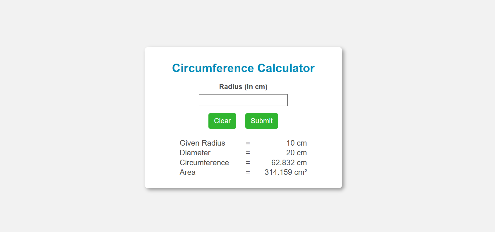
   Calculate the circumference of a circle based on user input for the radius.
2. [Counter Program](./counter-program)
   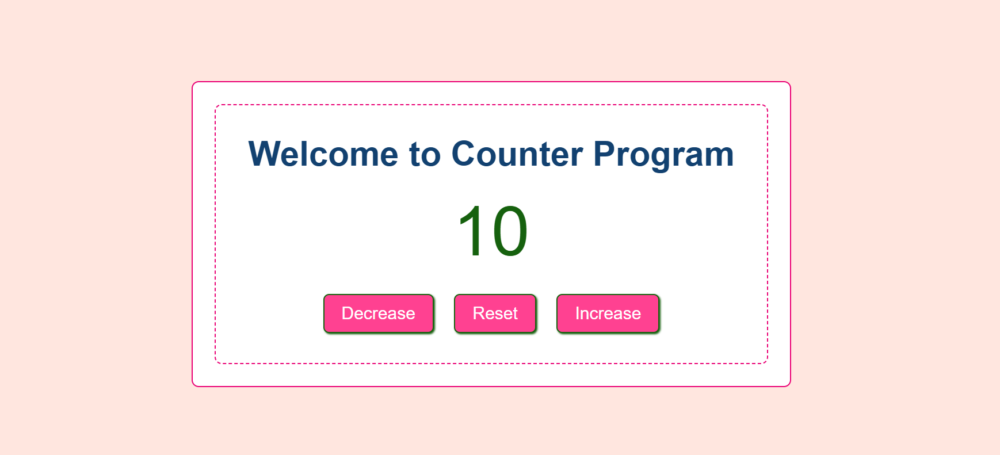
   A simple counter application that allows users to increase, decrease, and reset a counter value.
3. [Random Number Generator](./random-number-generator):  
   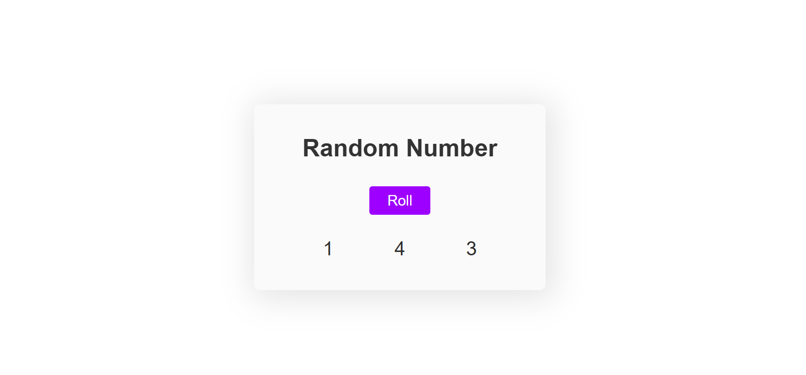
   Generate three random numbers between 1 and 6.
4. [Age Checking](./age-checking):
   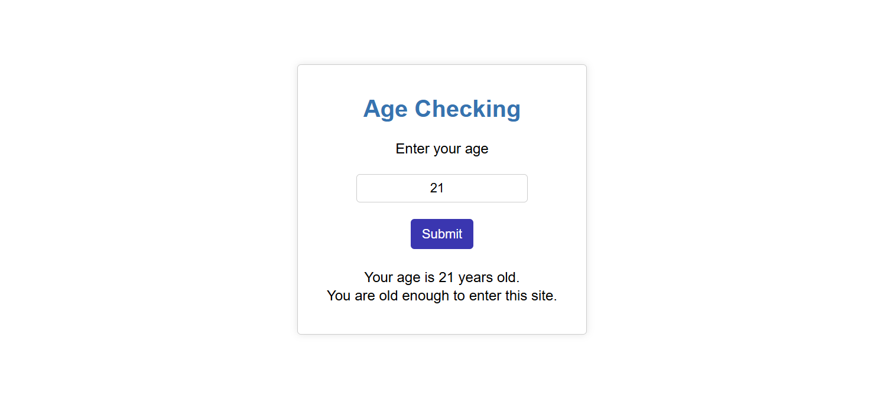
   Check if a user is old enough to enter a site based on their age input.
5. [Number Guessing Game](./guess-a-number):
   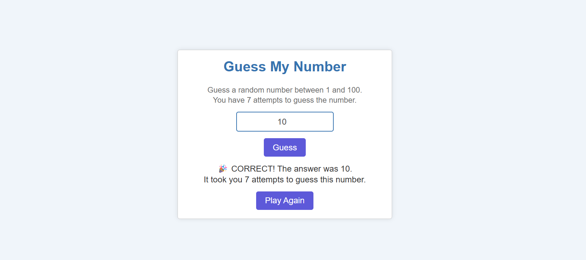
   A game where users guess a randomly generated number between 1 and 100.
6. [Temperature Converter](./temperature-conversion):
   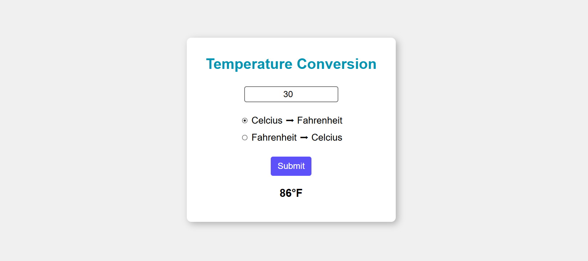
   Convert temperatures between Celsius and Fahrenheit.
7. [Dice Roller](./dice-roller-program):
   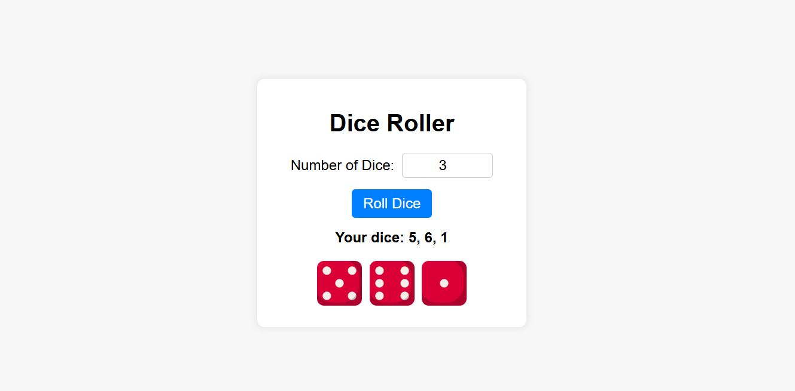
   Simulate rolling one or more dice and display the results.
8. [Password Generator](./random-password-generator):
   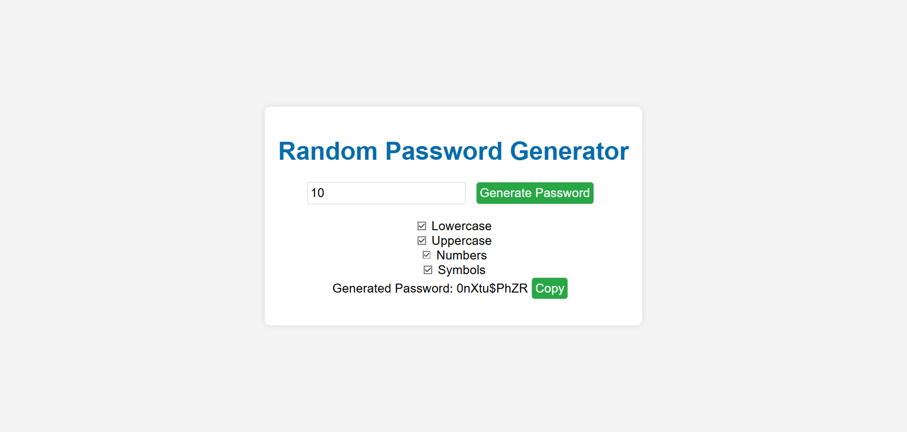
   Generate a random password based on specified criteria (whether it has symbols/numbers/lower or uppercase).
9. [Digital Clock](./digital-clock):
   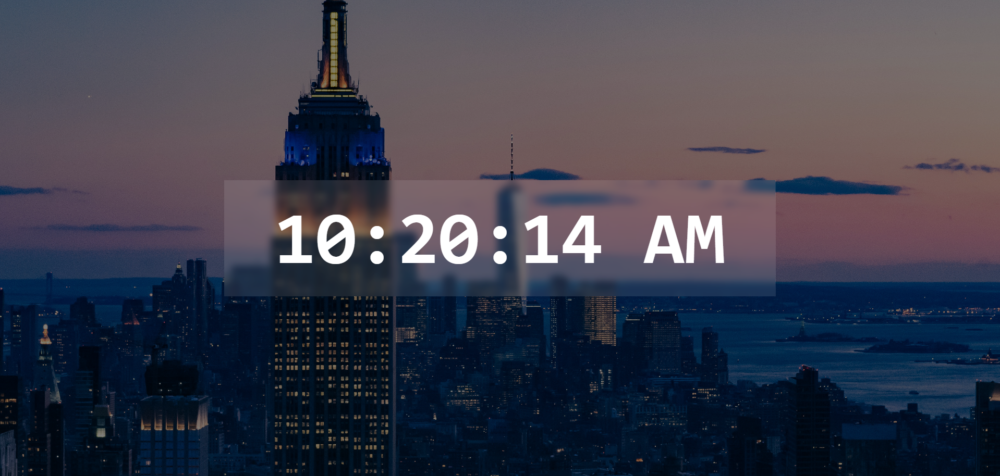
   A real-time digital clock displaying the current time.
10. [Stopwatch](./stopwatch):
    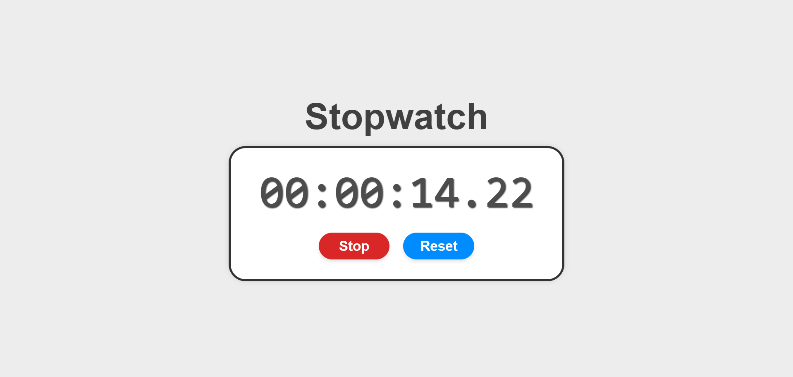
    A simple stopwatch application with start, stop, resume, and reset functionalities.
11. [Calculator](./calculator):
    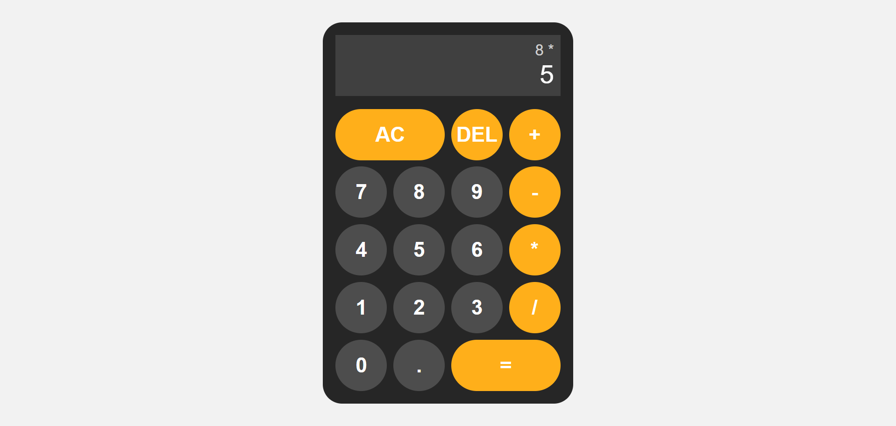
    A basic calculator that performs addition, subtraction, multiplication, and division.
12. [Rock Paper Scissors Game](./rock-paper-scissors):
    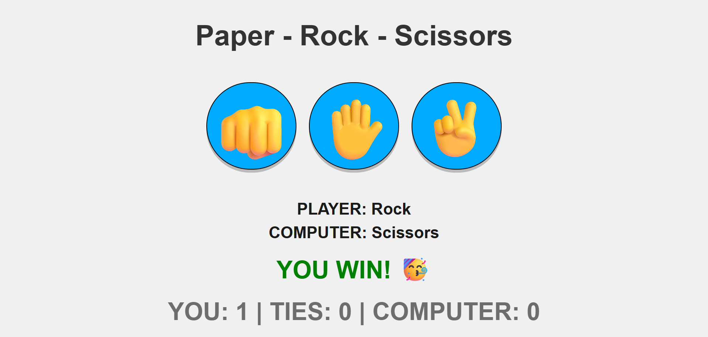
    A simple implementation of the classic Rock-Paper-Scissors game where users can play against the computer.
13. [Image Slider](./image-slider):
    
    An image slider that allows users to navigate through a set of images using next and previous buttons.
14. [Pokemon Hunt](./pokemon-hunt):
    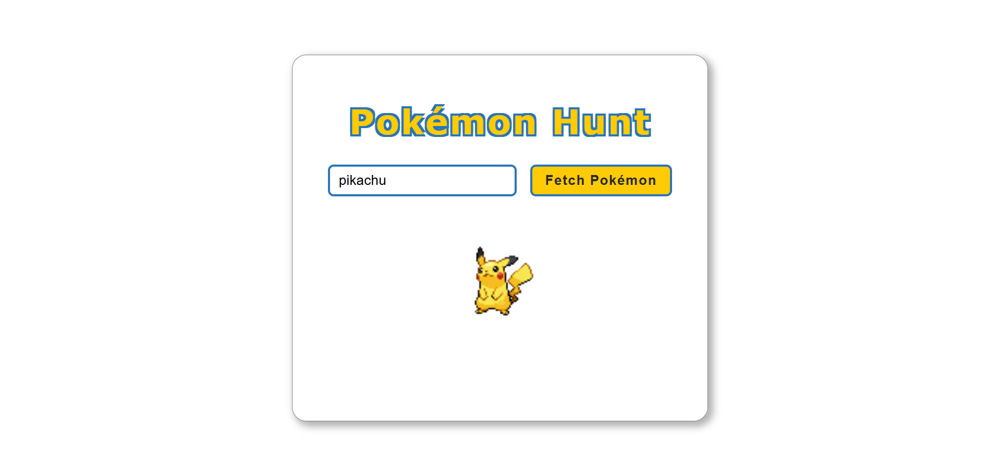
    Fetch and display Pokémon sprites based on user input using the [PokéAPI](https://pokeapi.co).
15. [Weather App](./weather-app):
    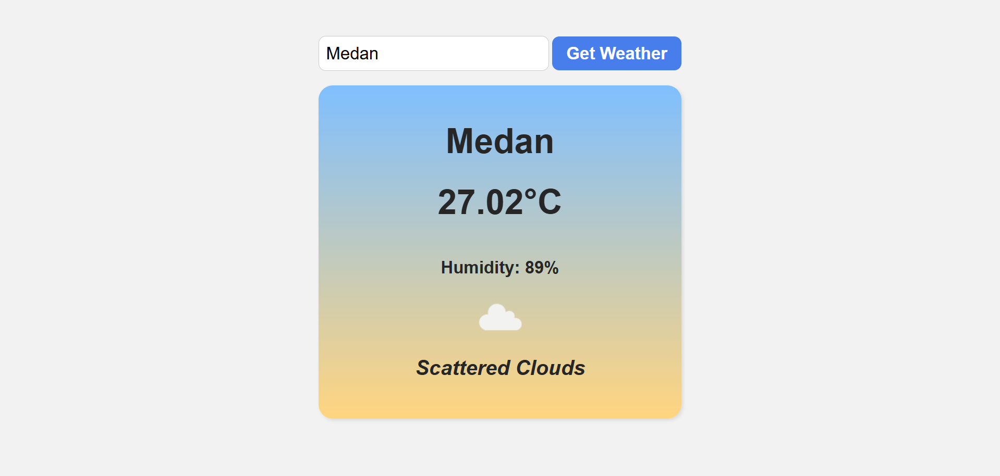
    A weather application that fetches and displays current weather data for a specified city using the [OpenWeather API](https://openweathermap.org/api).

## 🚀 How to Run

1. Clone this repository.
2. Open the folder in **VS Code**.
3. Install the extension **Live Server** (if not already).
4. Right-click `index.html` → **Open with Live Server**.
